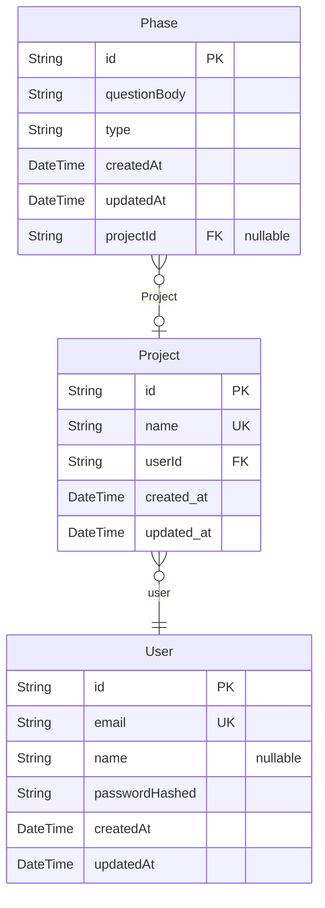

# PET System
> Generated by [`prisma-markdown`](https://github.com/samchon/prisma-markdown)

- [default](#default)

## default

### `User`

**Properties**
  - `id`: 
  - `email`: 
  - `name`: 
  - `passwordHashed`: 
  - `createdAt`: 
  - `updatedAt`: 

### `Project`

**Properties**
  - `id`: 
  - `name`: 
  - `userId`: 
  - `created_at`: 
  - `updated_at`: 

### `Phase`

**Properties**
  - `id`: 
  - `questionBody`: 
  - `type`: 
  - `createdAt`: 
  - `updatedAt`: 
  - `projectId`: 